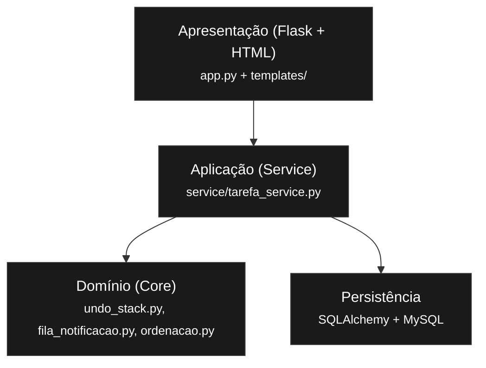

# Design Técnico e MVP — E2
**Estrutura de Dados**
**Prazo:** 14/05 | **Peso na nota:** 25% da nota final

---

## Identificação do Grupo

| Campo | Preenchimento |
|-------|---------------|
| Nome do projeto | Agenda Acadêmica |
| Repositório GitHub | https://github.com/Rodrigo3441/agenda-de-tarefas-estudantes |
| Integrante 1 | GABRIEL ALVES DE FARIAS — 42260221 |
| Integrante 2 | GISELE FRANCO DE LIMA — 42054583 |
| Integrante 3 | RODRIGO DE SOUZA GALVÃO — 43679650 |

---
# Contexto do Projeto

O projeto Agenda Acadêmica foi desenvolvido com o objetivo de aplicar conceitos fundamentais da disciplina de Estrutura de Dados em um sistema funcional voltado para organização de tarefas acadêmicas.

A proposta do sistema consiste em permitir o cadastro, edição, exclusão, importação e organização de tarefas por prioridade e data de entrega, utilizando estruturas clássicas de dados integradas a uma aplicação web construída em Python com Flask.

Além da implementação funcional, o projeto busca demonstrar separação de responsabilidades por camadas, aplicação prática de algoritmos de ordenação, manipulação de estruturas lineares e construção de um MVP funcional de ponta a ponta.

---

## 1. Escolha e Justificativa das Estruturas de Dados

### Estrutura 1 — Pilha (LIFO)
**Nome completo e categoria:** Pilha dinâmica baseada em lista — estrutura linear.

### Complexidade das operações principais

| Operação | Tempo | Espaço | Observação |
|---|---|---|---|
| Inserção (`push`) | O(1) | O(1) | Inserção no topo |
| Remoção (`pop`) | O(1) | O(1) | Remoção do topo |
| Busca | O(n) | O(1) | Busca linear |
| Acesso ao topo | O(1) | O(1) | Índice final da lista |

### Justificativa da escolha

A pilha foi escolhida para implementar o mecanismo de desfazer ações do sistema, pois segue naturalmente o comportamento LIFO (*Last In, First Out*). Em operações de edição de tarefas, a última alteração realizada pelo usuário deve ser a primeira a ser revertida.

Dessa forma, a pilha oferece um modelo adequado para armazenar estados temporários de alterações, permitindo que o sistema mantenha um histórico simples e eficiente de modificações recentes.

### Alternativa descartada

Foi considerada a utilização de uma fila FIFO para armazenar o histórico de alterações. Entretanto, essa abordagem foi descartada porque faria com que a primeira ação registrada fosse revertida primeiro, contrariando o comportamento esperado da funcionalidade de desfazer.

### Limitações conhecidas

A implementação atual mantém o histórico apenas em memória, sem persistência no banco de dados. Dessa forma, o histórico de desfazer é perdido ao reiniciar a aplicação.

Além disso, não há controle de tamanho máximo da pilha, o que pode aumentar o consumo de memória em cenários com grande volume de operações.

### Referência bibliográfica

CORMEN, T. H. et al. *Introduction to Algorithms*. 3. ed. MIT Press, 2009.

---

### Estrutura 2 — Fila (FIFO)
**Nome completo e categoria:** Fila dinâmica baseada em lista — estrutura linear.

### Complexidade das operações principais

| Operação | Tempo | Espaço | Observação |
|---|---|---|---|
| Inserção (`enqueue`) | O(1) | O(1) | Inserção ao final |
| Remoção (`dequeue`) | O(n) | O(1) | Uso de `pop(0)` |
| Busca | O(n) | O(1) | Busca linear |
| Acesso frontal | O(1) | O(1) | Primeiro elemento |

### Justificativa da escolha

A fila foi utilizada para organizar notificações e lembretes de tarefas de acordo com sua ordem de chegada. Esse comportamento segue o modelo FIFO (*First In, First Out*), adequado para garantir que as mensagens mais antigas sejam processadas primeiro.

No contexto do sistema, essa estrutura permite manter uma sequência lógica de notificações acadêmicas sem inversão da ordem cronológica.

### Alternativa descartada

A utilização de pilha foi descartada porque inverteria a ordem das notificações, fazendo com que mensagens mais recentes fossem exibidas antes das mais antigas.

### Limitações conhecidas

A implementação inicial utiliza listas nativas do Python por simplicidade de desenvolvimento no MVP. Entretanto, a operação `pop(0)` possui custo O(n), pois exige deslocamento dos elementos da lista.

Em versões futuras, a estrutura poderá ser substituída por `collections.deque`, permitindo operações de inserção e remoção em O(1), tornando a solução mais escalável.

### Referência bibliográfica

GOODRICH, M.; TAMASSIA, R. *Data Structures and Algorithms in Python*. Wiley, 2013.

---

### Estrutura 3 — Algoritmos de Ordenação (Insertion + Merge)
**Nome completo e categoria:** Algoritmos de ordenação aplicados sobre coleção linear de tarefas.

### Complexidade das operações principais do Insertion Sort

| Operação | Complexidade Média | Espaço | Observação |
|---|---|---|---|
| Ordenção | O(n²) | O(1) | Ordenação para lista de tarefas menores |

### Complexidade das operações principais do Merge Sort

| Operação | Complexidade Média | Espaço | Observação |
|---|---|---|---|
| Ordenção | O(n log n) | O(n) | Ordenação para lista de tarefas menores |

### Justificativa das escolhas

O sistema utiliza dois algoritmos de ordenação com objetivos distintos.

O Insertion Sort foi aplicado em listas menores devido ao seu baixo overhead computacional e simplicidade de implementação. Já o Merge Sort foi escolhido para listas maiores devido à sua complexidade O(n log n), garantindo melhor desempenho em cenários com maior volume de tarefas.

Essa divisão permite equilibrar simplicidade e eficiência conforme o tamanho da entrada processada.

### Alternativa descartada

A utilização exclusiva da função nativa `sort()` do Python foi descartada para que os algoritmos de ordenação fossem implementados manualmente, permitindo aplicação prática dos conceitos estudados na disciplina.

### Limitações conhecidas

O Insertion Sort apresenta degradação significativa em listas extensas, atingindo complexidade O(n²).

O Merge Sort, apesar de eficiente, possui maior consumo de memória devido à criação de listas auxiliares durante o processo de divisão e intercalação.

### Referência bibliográfica

SEDGEWICK, R.; WAYNE, K. *Algorithms*. 4. ed. Addison-Wesley, 2011.

---

## 2. Arquitetura em Camadas



| Camada | Nome no seu projeto | Responsabilidade |
|--------|---------------------|-----------------|
| Apresentação (UI/CLI) | `src/app.py`, `src/templates/` | Entradas e saídas |
| Aplicação (Service) | `src/service/tarefa_service.py` | Regras de negócio |
| Domínio (Core) | `src/core/` | Pilha, fila e ordenação |

---

## 3. Estrutura de Diretórios

```text
/
├── src/
│   ├── core/
│   │   ├── undo_stack.py
│   │   ├── fila_notificacao.py
│   │   └── ordenacao.py
│   │
│   ├── service/
│   │   └── tarefa_service.py
│   │
│   ├── database/
│   │   └── models.py
│   │
│   ├── templates/
│   │   ├── index.html
│   │   ├── resultado.html
│   │   └── editar.html
│   │
│   ├── static/
│   │   └── css/
│   │
│   └── app.py
│
├── tests/
├── data/
├── doc/
├── README.md
└── .gitignore
```

**Justificativa de desvios:** Não foi criada uma pasta isolada com o nome ui. Em vez disso, a interface foi implementada utilizando as pastas padrão `templates/` (HTML) e `static/` (CSS). Esta abordagem segue as convenções nativas do Flask, garantindo que o framework localize os arquivos automaticamente sem necessidade de configurações extras, além de manter a estrutura de arquivos mais limpa e organizada para uma aplicação Web.

---

## 4. Backlog do Projeto


### In-Scope — O que será implementado
1. Cadastro de tarefa  
   **Dado** formulário válido, **quando** salvar, **então** persiste e exibe no estado atual.
2. Edição de tarefa  
   **Dado** tarefa existente, **quando** editar e confirmar, **então** atualiza e exibe.
3. Exclusão de tarefa  
   **Dado** tarefa existente, **quando** excluir, **então** remove da base e da tela.
4. Importação por arquivo  
   **Dado** JSON/CSV/TXT válido, **quando** enviar, **então** importa e mostra sucesso.
5. Desfazer edição  
   **Dado** edição registrada, **quando** desfazer, **então** restaura estado anterior.

## Out-of-Scope — Funcionalidades não implementadas

| Funcionalidade | Motivo |
| :--- | :--- |
| **Autenticação de usuários** | Fora do escopo do MVP |
| **Aplicativo mobile nativo** | Prioridade atual é aplicação web |
| **Notificações por e-mail** | Complexidade adicional |
| **Sincronização em nuvem** | Não é requisito da entrega |

---

## 5. Repositório GitHub

**Link do repositório:** https://github.com/Rodrigo3441/agenda-de-tarefas-estudantes

- [x] Repositório público com nome descritivo
- [x] `.gitignore` configurado
- [x] `README.md` com execução
- [x] Mínimo de 5 commits semânticos

---

## 6. Implementação do Núcleo

### 6.1 Estrutura implementada: Pilha de Desfazer (UndoStack)
**Linguagem:** Python 3  
**Localização:** `src/core/undo_stack.py`

| Operação | Implementada? | Observação |
|----------|---------------|------------|
| `push` | ✅ | Insere ação no topo da lista |
| `pop` | ✅ | Remove última ação (LIFO) |
| `esta_vazia` | ✅ | Verificação se há ações pendentes |
| `visualizar` | ✅ | Retorna a lista de ações para depuração |

# Exemplo de implementação da Pilha de Desfazer

```python
class UndoStack:

    def __init__(self):
        self.pilha = []

    def push(self, acao):
        self.pilha.append(acao)

    def pop(self):
        """
        Remove e retorna o último elemento inserido.
        Retorna None caso a pilha esteja vazia.
        """
        if not self.esta_vazia():
            return self.pilha.pop()

        return None

    def esta_vazia(self):
        return len(self.pilha) == 0
```

**Leitura de arquivo:**

O sistema permite a importação de tarefas nos formatos **JSON**, **CSV** e **TXT**.

#### Formato TXT esperado
Para que o sistema processe o arquivo corretamente, os dados devem seguir a estrutura abaixo, utilizando o caractere pipe (`|`) como separador:

```text
titulo|descricao|data_entrega|prioridade
```

```text
Ler artigo sobre filas|Resumo para aula|2026-05-24|Media
Simulado de prova|Resolver lista antiga|2026-05-28|Alta
```

---

### 6.2 Estrutura implementada: Fila de notificações (FilaNotificação)
**Linguagem:** Python 3  
**Localização:** `src/core/fila_notificacao.py`

| Operação | Implementada? | Observação |
|----------|---------------|------------|
| `enqueue` | ✅ | Adiciona uma notificação na fila de exibição |
| `dequeue` | ✅ | Remove a notificação da fila e exibe ela para o usuário |
| `esta_vazia` | ✅ | Verificação se há notificações |
| `visualizar` | ✅ | Retorna notificações para o usuário |

# Exemplo de implementação da Fila de Notificações

```python
class FilaNotificacao:

    def __init__(self):
        self.fila = []

    def enqueue(self, mensagem):
        self.fila.append(mensagem)

    def dequeue(self):
        if not self.esta_vazia():
            return self.fila.pop(0)

        return None
```

- Não há operações com arquivo nessa estrutura FIFO.

---

## 7. MVP — Mínimo Produto Viável

### 7.1 Tipo de interface
- [✅] Web (Flask + Jinja2)

### 7.2 Tela 1 — Boas-vindas / Menu Principal
- [✅] Nome do sistema
- [✅] Operações disponíveis

### 7.3 Tela 2 — Entrada de Dados
- [✅] Campo para inserir valor
- [✅] Opção de carregar arquivo
- [✅] Confirmação da ação

### 7.4 Tela 3 — Resultado
- [✅] Resultado da operação
- [✅] Estado atual completo
- [✅] Mensagem de erro para operação inválida

### 7.5 Fluxo completo demonstrado
Usuário abre `/index`, cria tarefa, vai para `/resultado`, volta ao menu, importa arquivo, volta para `/resultado` com lista atualizada.

---

## 8. Testes Unitários

**Framework:** pytest  
**Localização:** `tests/test_undo_stack.py`, `tests/test_fila_notificacao.py`

- Teste 1 (caso base): ✅
- Teste 2 (caso vazio): ✅
- Teste 3 (múltiplos elementos): ✅

---

*Nome do arquivo de entrega: `E2_Grupo11_Design_Tecnico.md`*  
*Este arquivo está na pasta `/doc` do repositório.*
